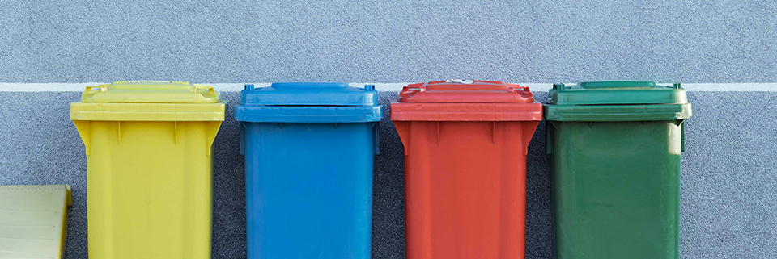

# Reciclaje inteligente

Proyecto DAM 2023.

Foto de [Pawel Czerwinski](https://unsplash.com/es/@pawel_czerwinski)
en [Unsplash](https://unsplash.com/es/fotos/cuatro-cubos-de-basura-de-colores-variados-junto-a-la-pared-gris-RkIsyD_AVvc).

## El reto

Una empresa de desarrollo de software de Vitoria-Gasteiz os acaba de contratar y ya tenéis vuestro primer proyecto entre
manos: desarrollar un sistema de reciclaje inteligente para enseñar a niños de primaria en qué contenedor deben
depositar qué producto.

El sistema tiene que ser capaz de distinguir entre varios tipos de envases (ej. botellas de plástico, vasos de papel,
bricks, ...) e indicar al usuario qué contenedor le corresponde (amarillo, azul, ...).

Para reconocer los diferentes productos necesitaréis entrenar un modelo
de [aprendizaje automático](https://es.wikipedia.org/wiki/Aprendizaje_automático)
mediante [Teachable Machine](https://teachablemachine.withgoogle.com).

En caso de no ser capaz de reconocer el producto el sistema avisará al usuario y le dirá que pida ayuda a un adulto.

## Tareas a realizar

1. Entrenar un modelo de aprendizaje automático que reconozca al menos tres tipos de envases.
2. Crear una aplicación que muestre de forma amigable las salidas del modelo a los niños.
3. Diseñar cómo podría implantarse este prototipo en el mundo real (imaginad cómo sería el producto terminado y
   describid lo que haría falta para ello).

## Sugerencias

- Para entrenar el modelo necesitaréis una webcam (hay disponibles varias para prestar, pedidlas si os hacen falta).
- A la hora de exportar el modelo desde Teachable Machine hacedlo como un modelo
  de [Tensorflow](https://www.tensorflow.org) de [OpenCV Keras](https://opencv.org). Esto os permitirá
  utilizarlo directamente en cualquier aplicación escrita en Python.

## Restricciones

- La herramienta para generar el modelo tiene que ser [Teachable Machine](https://teachablemachine.withgoogle.com).
- La app estará escrita en Python.
- El trabajo se realizará de forma individual o, como máximo, en equipos de dos personas.
- Solo se hará una entrega por equipo. Incluid los nombres de los componentes del equipo en el README del repositorio
  para que no haya confusiones.
- Como entrega del proyecto se incluirán en este repositorio todos los archivos fuente del proyecto, los modelos
  generados y el documento con el diseño del proyecto para el mundo real.
- Todo el software, material gráfico y recursos utilizados deberán ser de fuentes libres o de dominio público
  verificable y serán atribuidos adecuadamente.

## Plazo

- Fecha de entrega: 26/01/2024 a las 22:00h.

## Importante

- **Recordad subir el resultado a Gitea** mediante _Commit and Push_.
- **No habrá tolerancia con los plagios**. Si se detecta un caso así el resultado será un 0 automático en la actividad,
  tanto para la persona que plagie como para la que permita que su proyecto sea plagiado.
- **Para que la tarea pueda ser calificada correctamente, procurad enviarla antes de que expire el tiempo límite.**

## Rúbrica de evaluación

|                              | No entregado (0)                                     | Insuficiente (2)                                                           | Insuficiente (4)                                                        | Superado (6)                                                                                                                                                  | Destacado (8)                                                                                                                                                 | Excelente (10)                                                                                                                                                |
|------------------------------|------------------------------------------------------|----------------------------------------------------------------------------|-------------------------------------------------------------------------|---------------------------------------------------------------------------------------------------------------------------------------------------------------|---------------------------------------------------------------------------------------------------------------------------------------------------------------|---------------------------------------------------------------------------------------------------------------------------------------------------------------|
| Plazo                        | No se ha entregado el proyecto en el plazo previsto. | El proyecto se ha entregado a tiempo.                                      | El proyecto se ha entregado a tiempo.                                   | El proyecto se ha entregado a tiempo.                                                                                                                         | El proyecto se ha entregado a tiempo.                                                                                                                         | El proyecto se ha entregado a tiempo.                                                                                                                         |
| Entrega                      |                                                      | No se ha entregado el código fuente, los modelos o el documento de diseño. | Se ha entregado el código fuente, los modelos y el documento de diseño. | Se ha entregado el código fuente, los modelos y el documento de diseño.                                                                                       | Se ha entregado el código fuente, los modelos y el documento de diseño.                                                                                       | Se ha entregado el código fuente, los modelos y el documento de diseño.                                                                                       |
| Requisitos mínimos          |                                                      |                                                                            | No funciona correctamente o faltan requisitos obligatorios.             | - El modelo reconoce al menos tres tipos de productos.   - La app funciona correctamente.   - El documento de diseño es correcto pero no muy detallado. | - El modelo reconoce al menos tres tipos de productos.   - La app funciona correctamente.   - El documento de diseño es correcto pero no muy detallado. | - El modelo reconoce al menos tres tipos de productos.   - La app funciona correctamente.   - El documento de diseño es correcto pero no muy detallado. |
| Características adicionales |                                                      |                                                                            |                                                                         |                                                                                                                                                               | - Interfaz de usuario de la aplicación amigable.                                                                                                              | - Interfaz de usuario de la aplicación amigable.                                                                                                              |
| Extras                       |                                                      |                                                                            |                                                                         |                                                                                                                                                               |                                                                                                                                                               | - Documento de diseño detallado e imaginativo.                                                                                                                | 